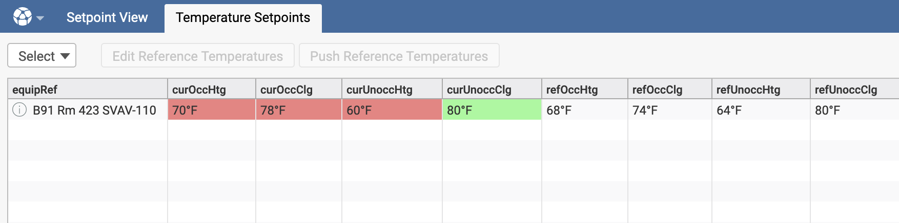
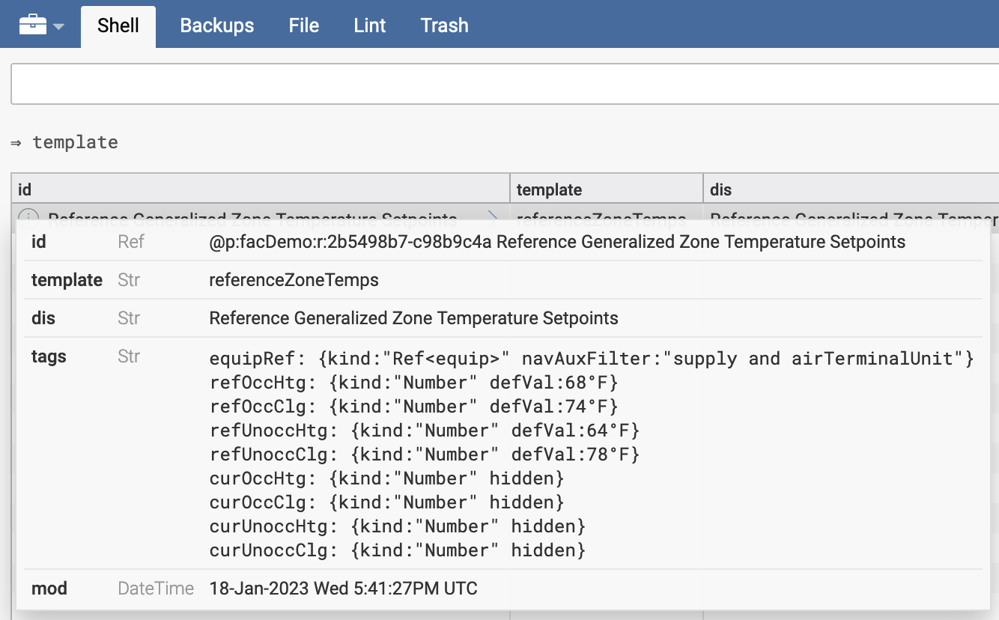
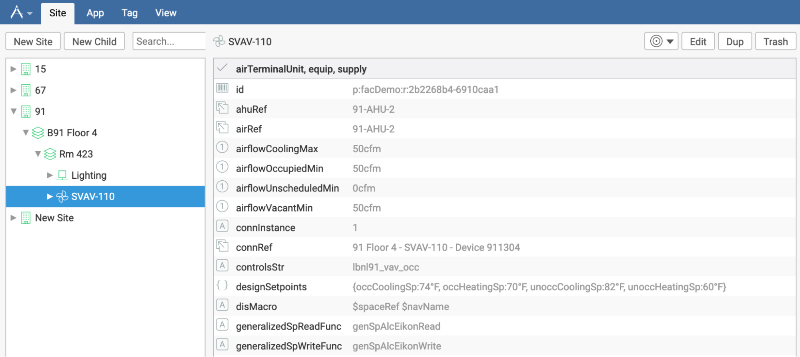
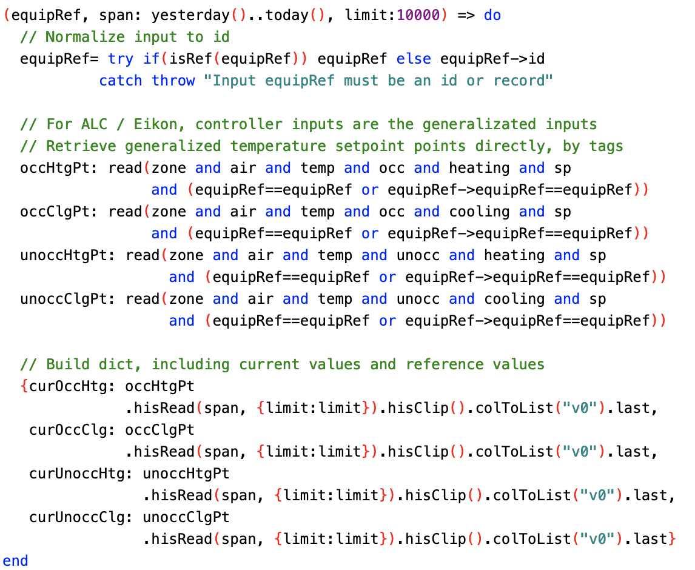
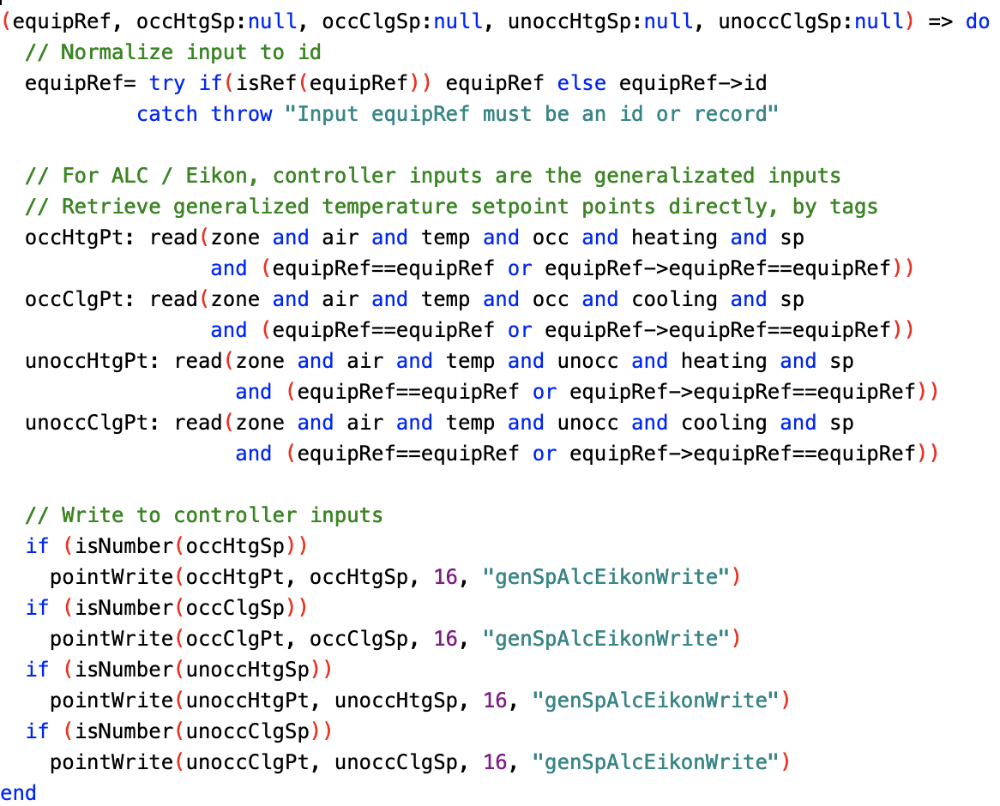
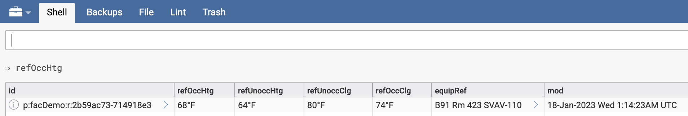
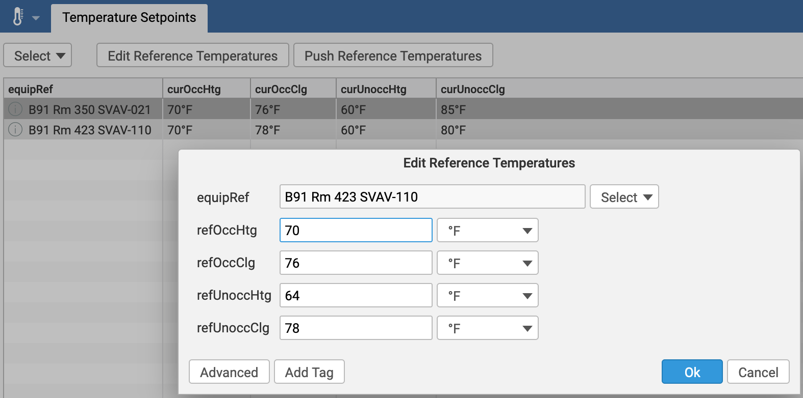
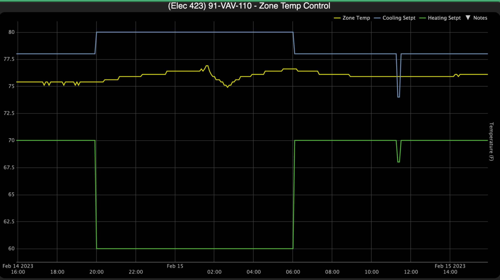
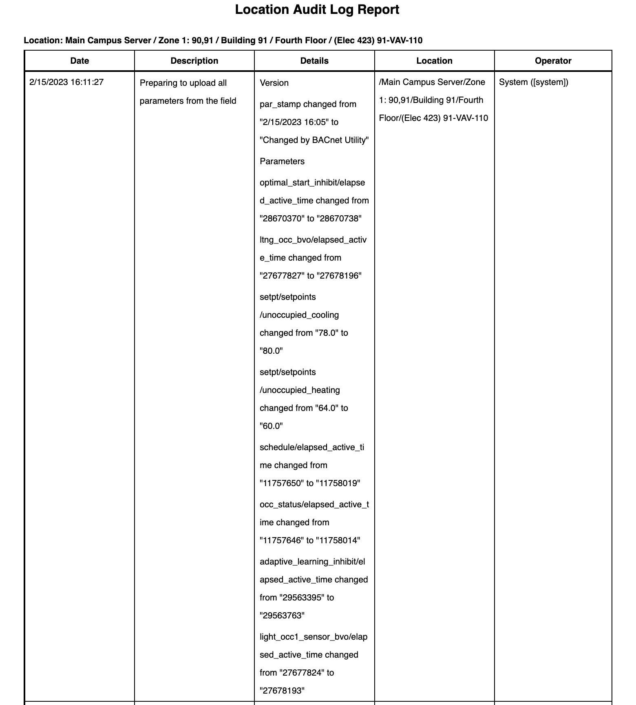

## Introduction

The Temperature Setpoints view displays all supply terminal units for a selected site, along with their related generalized zone temperature setpoints - both current values and reference values.

These generalized values exclude occupant adjustments and demand controls, they are:

* Occupied Heating Setpoint
* Occupied Cooling Setpoint
* Unoccupied Heating Setpoint
* Unoccupied Cooling Setpoint

These points have fixed values over long periods of time, and they do not reflect occupant adjustments at the thermostats.

Figure 1: Screenshot of Temperature Setpoints view for B91 - only one supply terminal unit is configured in this project

The Temperature Setpoints view highlights in red the current setpoints if they deviate from the reference. It highlights in green the current setpoints that match the reference, and the entire row if all setpoints match their references.

The view also offers two actions, which both require that one row be selected.

* Edit Reference Temperatures: opens a form to edit the reference values
* Push Reference Temperatures: for each input that deviates from its reference, writes reference values to the BMS

## Reference Values

Reference values are stored in folio records, one per terminal unit. The associated template is “referenceZoneTemps”.

>>>>>  gd2md-html alert: inline image link here (to images/image2.png). Store image on your image server and adjust path/filename/extension if necessary.  (<a href="#">Back to top</a>)(<a href="#gdcalert3">Next alert</a>) >>>>> 

Figure 2: Sample referenceZoneTemps record for B91 SVAV-110

>>>>>  gd2md-html alert: inline image link here (to images/image3.png). Store image on your image server and adjust path/filename/extension if necessary.  (<a href="#">Back to top</a>)(<a href="#gdcalert4">Next alert</a>) >>>>> 

Figure 3: Template for referenceZoneTemps

## Current Values

The Temperature Setpoints view is based on the viSiteZoneTempReferenceSetpoints function, which builds a table by cycling through all supply airTerminalUnit equipment records for a selected site, and retrieves current and reference values for each via the viZoneTempSetpoints function. Formatting is then applied, for example to highlight matches and discrepancies.

Function viZoneTempSetpoints loads reference values from folio based on the id of the supply airTerminalUnit, and also queries the supply airTerminalUnit equipment to determine what function to call to obtain the current generalized temperature values. The function name is stored as text in the generalizedSpReadFunc tag.

>>>>>  gd2md-html alert: inline image link here (to images/image4.png). Store image on your image server and adjust path/filename/extension if necessary.  (<a href="#">Back to top</a>)(<a href="#gdcalert5">Next alert</a>) >>>>> 

Figure 4: Sample supply airTerminalUnit equip, with generalizedSpReadFunc

Functions that can be used as generalizedSpReadFunc must meet the following requirements:

* First input must be id of supply airTerminalUnit (**equipRef**)
* Output dictionary {**curOccHtg**, **curOccClg**, **curUnoccHtg**, **curUnoccClg**}

The output dictionary must use the specified keys for the current values of generalized inputs:

* **curOccHtg** - Current Occupied Heating Setpoint
* **curOccClg** - Current Occupied Cooling Setpoint
* **curUnoccHtg** - Current Unoccupied Heating Setpoint
* **curUnoccClg** - Current Unoccupied Cooling Setpoint

>>>>>  gd2md-html alert: inline image link here (to images/image5.png). Store image on your image server and adjust path/filename/extension if necessary.  (<a href="#">Back to top</a>)(<a href="#gdcalert6">Next alert</a>) >>>>> 

Figure 5: Sample generalizedSpReadFunc for ALC - no conversion needed

## Correction Values

Similarly to current values, the action function recPushReferenceZoneTemps will look up what function to call to correct inputs by writing to the BMS. The function name is stored as text in the generalizedSpWriteFunc tag of the selected supply airTerminalUnit equip.

Functions that can be used as generalizedSpWriteFunc must meet the following requirements:

* Inputs must be, in order (**equipRef**, **occHtgSp**:null, **occClgSp**:null, **unoccHtgSp**:null, **unoccClgSp**:null)
* Input values of null are used for generalized inputs that do not need correction
* Output is optional and will not be used

The dedicated functions are tasked with

* Translating from desired generalized input values to controller input values,
* Writing those values to the controller inputs.

>>>>>  gd2md-html alert: inline image link here (to images/image6.png). Store image on your image server and adjust path/filename/extension if necessary.  (<a href="#">Back to top</a>)(<a href="#gdcalert7">Next alert</a>) >>>>> 

Figure 6: Sample generalizedSpWriteFunc for ALC - no conversion needed

## Setup Notes

Copy view

Copy template

Copy functions

Set generalizedSpReadFunc and generalizedSpWriteFunc tags on existing supply terminal units

>>>>>  gd2md-html alert: inline image link here (to images/image7.png). Store image on your image server and adjust path/filename/extension if necessary.  (<a href="#">Back to top</a>)(<a href="#gdcalert8">Next alert</a>) >>>>> 

Figure 7: Modifying existing supply airTerminalUnit records to add generalizedSpReadFunc

Inputs already configured as writable at B91

Set reference temperatures, using the view

>>>>>  gd2md-html alert: inline image link here (to images/image8.png). Store image on your image server and adjust path/filename/extension if necessary.  (<a href="#">Back to top</a>)(<a href="#gdcalert9">Next alert</a>) >>>>> 

Figure 8: Using the Edit Reference Temperatures button to set the reference temperatures for a zone

Push reference temperatures to the BMS, using the view

>>>>>  gd2md-html alert: inline image link here (to images/image9.png). Store image on your image server and adjust path/filename/extension if necessary.  (<a href="#">Back to top</a>)(<a href="#gdcalert10">Next alert</a>) >>>>> 

Figure 9: Trends in ALC show changes in setpoint around 11:15, reversed manually after a few minutes

This generates a fairly long audit log note in ALC

>>>>>  gd2md-html alert: inline image link here (to images/image10.png). Store image on your image server and adjust path/filename/extension if necessary.  (<a href="#">Back to top</a>)(<a href="#gdcalert11">Next alert</a>) >>>>> 

Figure 10: Audit log in ALC after zone temperature setpoint correction
